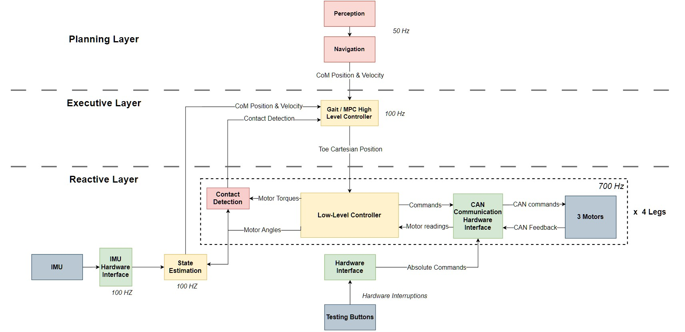

# AU Quadruped Robot ROS2 Code

## Overview

This repository contains the code and instructions for setting up and running the AU Quadruped Robot using ROS2. Follow the steps below to build and launch the necessary components.

## Prerequisites

- **Docker**: Ensure that Docker is installed on your system.
- **Raspberry Pi 5**: This setup is optimized for the Raspberry Pi 5 with an ARMv8 processor. Modifications may be required for different platforms.

## Setting Up Docker

### Building the Docker Image

1. Navigate to your workspace directory:
    ```bash
    cd ws
    ```

2. Build the Docker image:
    ```bash
    sudo docker build -t wetguard .
    ```

### Running the Docker Container

Run the Docker container with the following command, adjusting the path to your workspace as needed:
```bash
sudo docker run -it --user ros --network=host --ipc=host \
    -v /tmp/.X11-unix:/tmp/.X11-unix:rw \
    --env=DISPLAY \
    -v /home/pi/ws/ros2_ws:/ros2_ws \
    -v /dev:/dev \
    --device-cgroup-rule='c *:* rmw' \
    -v /dev/gpiochip4:/dev/gpiochip4 \
    --cap-add=NET_ADMIN ros2
```

### Building the Workspace Inside Docker

Once inside the container, build your workspace:
```bash
cd ~/ros2_ws
colcon build
```

## Launching Nodes

### Control Interface Node
To launch the Control Interface Node, run:
```bash
ros2 run control_interface_package button_reader
```

### IMU Node 
To launch the IMU Node with a custom parameter file, use:
```bash
ros2 run imu_bno055 bno055_i2c_node 
```
Note: credits to [dheera](https://github.com/dheera/ros-imu-bno055)

### Actuators Node
Launch the Actuators Node with:
```bash
ros2 run comm_interface leg_comm
```

### Crawl Gait Node
Start the Crawl Gait Node by executing:
```bash
ros2 run gait_pkg crawl_gait
```

### State Estimator
To run the State Estimator, use:
```bash
ros2 run estimation_pkg state_estimation
```

## Software Architecture

The following diagram illustrates the software architecture implementation:



## Control Interface Basic Test

Watch a demonstration of the control interface [here](https://youtube.com/shorts/MwS2y61EkHA?feature=shared).

---

### Notes

- Ensure that all commands are executed in the correct environment.
- Review your workspace paths to avoid any errors during the Docker run command.
