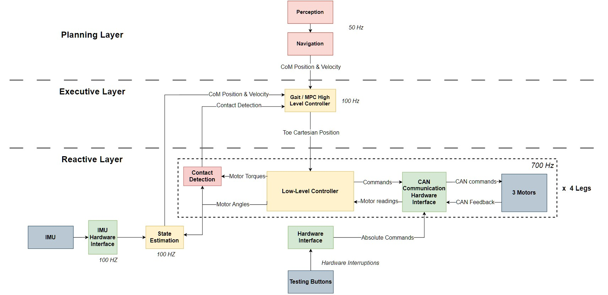
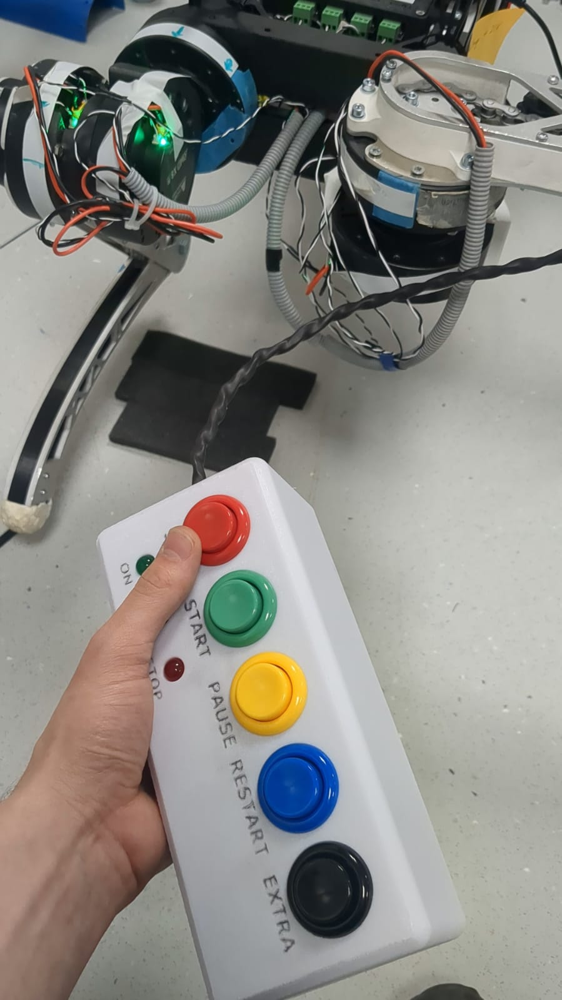
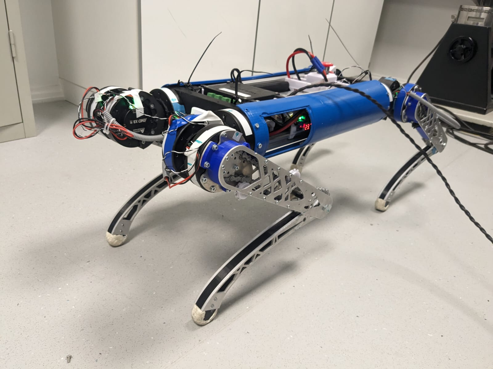
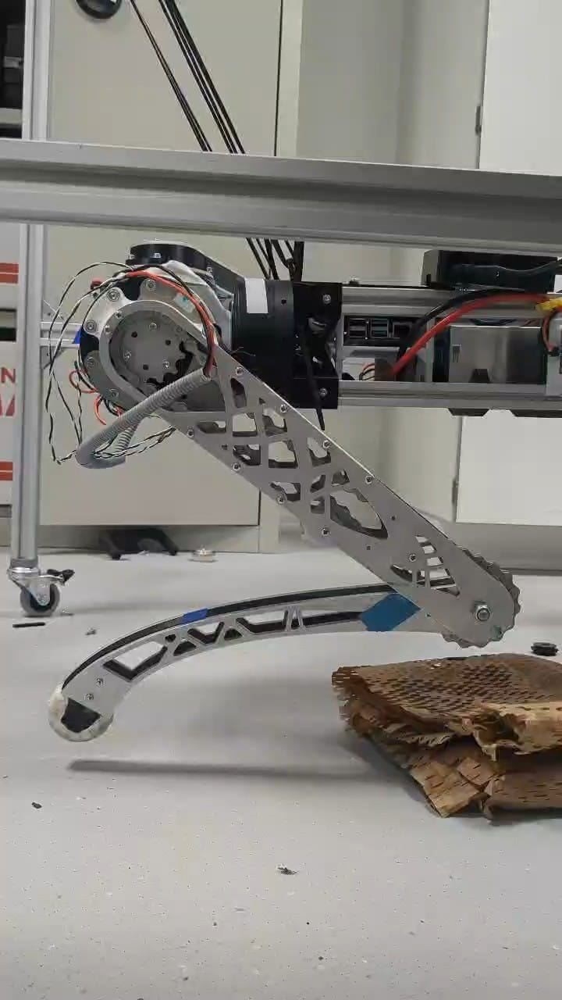

# AU Quadruped Robot

## Overview

The purpose of this project is to create an easily manufacturable quadruped robot with open-source code. Throughout the design process, we aim to explore various anatomical configurations inspired by animals that are not commonly chosen, such as horses or deer. Currently, the robot has achieved stable crawl gait performance in real life and has successfully implemented dynamic gaits in simulation.
The simulation aspect is still confidential and requires migration to ROS2 Humble - stay tuned for updates!
This repository also showcases the development of high performance hardware interfaces and demonstrations of the robot operating in real-life scenarios.


### Highlights of the current version and my contributions to the software of this project:

	- High-performance and reliable hardware interface for our 12 actuators, enabling feedback at 500Hz.
	- Control box that provides commands with minimal latency, thanks to asynchronous interruptions.
	- Kalman filter used to fuse data from the IMU and the kinematic model of the legs, capable of tracking the position of the robot in real time.
	- Gait package that supports a crawl gait using Bezier curves, mimicking natural leg swings.
	- ROS2 drivers to run more advanced controllers on the current system.


## Prerequisites

- **Docker**: Ensure that Docker is installed on your system.
- **Raspberry Pi 5**: This setup is optimized for the Raspberry Pi 5 with an ARMv8 processor. Modifications may be required for different platforms.

## Setting Up Docker

### Building the Docker Image
1. Clone the repository in your workspace
```bash
    cd ws
    git clone https://github.com/josepablovr/Aarhus-University-Quadruped-Robot
   ```

2. Navigate to your workspace directory and build the Docker image:

```bash
    cd ws
    sudo docker build -t ros2 .
```

### Running the Docker Container

Run the Docker container with the following command, adjusting the path to your workspace as needed:
```bash
sudo docker run -it --user ros --network=host --ipc=host \
    -v /tmp/.X11-unix:/tmp/.X11-unix:rw \
    --env=DISPLAY \
    -v /home/pi/ws/ros2_ws:/ros2_ws \
    -v /dev:/dev \
    --device-cgroup-rule='c *:* rmw' \
    -v /dev/gpiochip4:/dev/gpiochip4 \
    --cap-add=NET_ADMIN ros2
```

### Building the Workspace Inside Docker

Once inside the container, build your workspace:
```bash
cd ~/ros2_ws
colcon build
```

## Launching Nodes

### Control Interface Node
To launch the Control Interface Node, run:
```bash
ros2 run control_interface_package button_reader
```

### IMU Node 
To launch the IMU Node use:
```bash
ros2 run imu_bno055 bno055_i2c_node 
```
Note: credits to [dheera](https://github.com/dheera/ros-imu-bno055)

### Actuators Node
Launch the Actuators Node with:
```bash
ros2 run comm_interface leg_comm
```

### Crawl Gait Node
Start the Crawl Gait Node by executing:
```bash
ros2 run gait_pkg crawl_gait
```

### State Estimator
To run the State Estimator, use:
```bash
ros2 run estimation_pkg state_estimation
```

### Run High-Performance State Estimation Demo
This is a ROS2 driver of the Unitree Go controllers for this robot

```bash
ros2 run lowlevel lowlevel
```

## Software Architecture

The following diagram illustrates the software architecture implementation:



Note: Some of the nodes have not been implemented.


## Take a look at our Demos!
### Control Interface Demo
Watch a demonstration of the control box used to test our controlllers



[Click here to watch](https://youtube.com/shorts/MwS2y61EkHA?feature=shared).

### Crawl Gait Demo
Watch a demonstration of the robot performing a static gait walking forward



[Click here to watch](https://youtu.be/HeLdU54lCw4).


### Cartesian Force Control Demo
Watch a demonstration of an advanced control scheme implemented in a single leg



[Click here to watch](https://youtube.com/shorts/F7HndIHD2LE?feature=share).


### Notes

- Ensure that all commands are executed in the correct environment.
- Review your workspace paths to avoid any errors during the Docker run command.


### Future of this project:

- Migration of Gazebo simulation to ROS2 Humble.
- Implementation of a faster IMU to enable better control schemes.
- Implementation and adaptation of our developed controllers for dynamic gaits (WBC + MPC).
